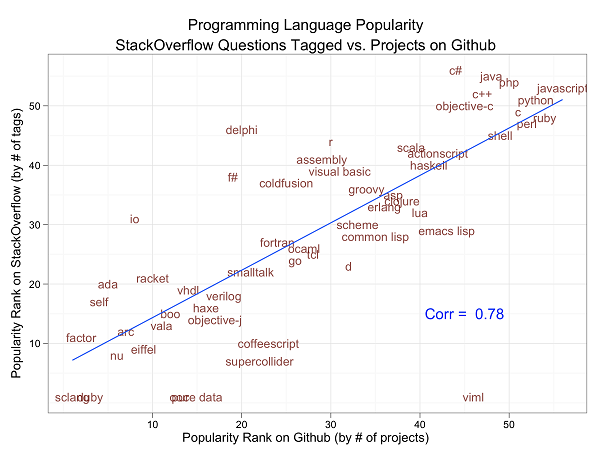
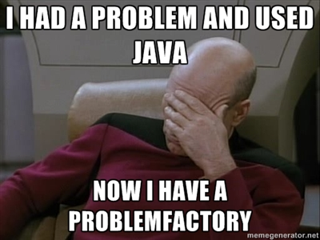
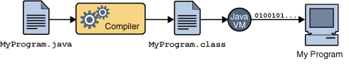
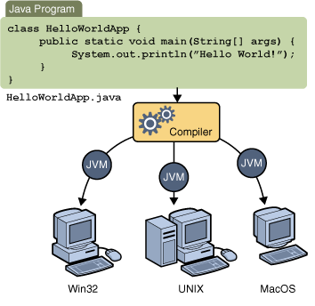

!SLIDE 
<h1>Marcin Matuszak</h1>

!SLIDE

# Course Administrivia #

* starts 17.10.2012, 17.00 - 19.00

!SLIDE 

# Assignments and Grading

!SLIDE smaller

# Course Objectives #

* Learn the Java programming language
* Become comfortable with object oriented programming
* Learn the essentials of the Java class library
* Introduce event driven GUI programming
* Introduce tools and libraries 

!SLIDE

# Prerequisites #

* Substantial Programming Experience
* Some basic computer skills
	
!SLIDE 

# Textbook #

<!-- * The Java Tutorial 4th Edition
* Introduction to Programming Using Java, Sixth Edition
* Thinking in Java by Bruce Eckel -->

!SLIDE smaller

<b>Praktykant w ATOS</b>

Miejsce pracy: <b>Wrocław</b>

Nr referencyjny: <b>143386</b>

ATOS IT Solutions and Services Sp. z o.o. oferuje program praktyk studenckich
skierowanych do studentów ostatnich lat i absolwentów. Celem praktyk jest
umożliwienie nabycia praktycznego doświadczenia z wybranych obszarów.
Obecnie poszukujemy praktykantów zainteresowanych rozwojem w jednym z obszarów:

1) Sekcja Java

wymagana podstawowa znajomość Java

2) Sekcja Microsoft:

wymagana podstawowa znajomość C# i Visual Studio lub

wymagana podstawowa znajomość Sharepoint

3) Sekcja Testów:

poszukujemy studentów chcących zapoznać się z metodami testowania.

!SLIDE
# Programming languages before 1990 #
* 1954 - 55 Fortran
* 1956 - 58 Lisp
* 1959 Cobol
* 1970 Pascal
* 1972 C  / 1983 C++

!SLIDE
# and after 1990 #
* 1991 Python, **Java** 
* 1995 Ruby, ** Java 1st release **
* 2003 Scala
* 2007 Clojure
	

!SLIDE

# History

* 1991 - James Gosling (& others) started Java project
* 1995 - Java alph / beta
* 1996 - first public release
* 1998 - Java 1.2
* 2000 - Java 1.3
* 2002 - Java 1.4

!SLIDE 

# History

* 2004 - Java 5
* 2006 - Java 6
* 2011 - Java 7
* 2013 (Java 8), 2015 (Java 9), 2017 (Java 10) 

!SLIDE smaller
# About Java
* Simple
* Object oriented
* Distributed
* Multithreaded
* Dynamic
* Architecture neutral
* Portable
* High performance
* Secure

!SLIDE center
[Źródlo][^1]

[^1]: http://www.readwriteweb.com/hack/2012/06/5-ways-to-tell-which-programming-lanugages-are-most-popular.php

.notes +: dwa źródla danych
.notes -: uwzglednia tylko nowe projekty, zazwyczaj nowe technologie. Stare trzymane sa na sourceforge, apache. istnieje jeszcze bitbucket. pytania na stackoverflow moga uwzgledniac 
trudnosc jezyka a nie jego popularność

 

.notes Pros: This method draws on two different data sources, and reflects what developers choose to use on their own projects.
 
.notes Cons: Because Github houses so many personal projects, these results don’t necessarily reflect what developers are actually being paid to use. Github may also favor newer languages, since many of the older projects using tried-and-true languages such as Java and Perl are still hosted at Sourceforge, Apache and elsewhere. Also, a high number of StackOverflow questions may be more of a reflection of the complexity of a language rather than its popularity. It may also skew toward newer languages that developers may have more questions about. And yes, perhaps RedMonk could have integrated Bitbucket projects into these rankings, as well.

!SLIDE center

# Top 5/yr job offers [Dice.com][^2] #

### Java (16,152 jobs)
### HTML (9,736 jobs)
### XML (9,651)
### JavaScript (9,618)
### C# (7,940)

[^2]: http://www.readwriteweb.com/enterprise/2011/05/it-hiring-and-salaries-up---wh.php

.notes Pros: These results are more indicative of what's actually being used in 'the real world' than other metrics.
Cons: As such, it doesn't reflect programmers' preference. Also, these search results are not direct representation of what's actually being used. Further, Dice.com may not be reflective of the overall market.

!SLIDE center

## Books sell [O'Reilly][^1]

### Java
### JavaScript
### C#
### Objective C
### C++

.notes Pros: Developers buy books for both pleasure and work, so these numbers could reflect a sweet spot between business and pleasure.

.notes Cons: May skew against older languages like Perl, about which fewer new books may be published. This ranking also doesn't factor in other publishers that may sell more books on particular languages.

.notes rok 2010 

[^1]: http://www.readwriteweb.com/enterprise/2011/05/it-hiring-and-salaries-up---wh.php

!SLIDE center
[^1][^1]

[^1]: http://www.jroller.com/obie/entry/top_10_reasons_why_java

!SLIDE smaller

	@@@ Java

	int x = 5; 
	x += 2.5 //x = 7

	int y = 5;
	y = y + 2.5 // y = ?

!SLIDE smaller

	@@@ Java

	int x = 5; 
	x += 2.5 //x = 7, implicit casting

	int y = 5;
	//y = y + 2.5 // error
	y = y + (int)2.5;

!SLIDE smaller

	@@@ Java

	public class LongDivision {
		private static final long MILLIS_PER_DAY
				= 24 * 60 * 60 * 1000;
		private static final long MICROS_PER_DAY
				= 24 * 60 * 60 * 1000 * 1000;
		
		public static void main(String[] args)  {
			System.out.println(MICROS_PER_DAY / MILLIS_PER_DAY);
		}
	}

	What does it print?
	a. 5
	b. 1000
	c. 5000
	d. throws exception

!SLIDE bullet incremental smaller

# Reasons Why Java Sucks Ass [^1][^1] [^2][^2] #
* Java has a compiler; Java is too Fragmented; Java is Too Slow; Java doesn't have blocks and closures;
* Java has good debugging support; Java has Integrated Development Environments (IDEs);
* Java Makes a Lot of Money for Vendors;
* Not interactive; No macros (preprocessors don't count);
* No anonymous methods (anonymous classes exist, but as a substitute are hideous);
* Java Server Pages mix procedural code with markup;
* Single inheritance; Private methods 

[^1]: http://www.jroller.com/obie/entry/top_10_reasons_why_java
[^2]: http://web.onetel.com/~hibou/Why%20Java%20is%20Not%20My%20Favourite%20Programming%20Language.html

!SLIDE bullet incremental smaller
# Seven reasons you should use Java again [^1][^1] #

* You can actually hire engineers
* IDEs take the pain away
* Language support
* Android
* Everybody else does
* It changes slowly
* You’ll end up using it anyway

[^1]: http://radar.oreilly.com/2011/07/7-reasons-to-use-java.html

!SLIDE smaller

# Java developer job offer
Basic Qualifications:
·        Experience in application development using Java, J2EE, JFC/SWING, EJB 2.0, Hibernate, Castor JDO, - --   JDBC, WebWork, Jakarta Struts, JSP, Servlets, HTML, XML, RMI, SOAP, JBoss.
·        Proficient in database development: Oracle, DB2, MS SQL, MySQL, Red hat Directories
·        Experienced in Software development and business modeling of Web applications, Client/Server systems, Distributed Applications and other custom-built projects on UNIX and Windows.  Strong in Object - oriented design/analysis, UML modeling, Classic design patterns, J2EE patterns.
·        Extensive experience in Java deveolpment GUI using JFC, Swing, JavaBeans, AWT.
·        Thorough knowledge with J2EE application platform configuration and performance optimization, application deployment technology, EJB transaction implementation (CMP, BMP, Message-Driven Beans)
·        Strong Web development skills. Experience in N-tier Client-Server based Internet technology, intranet portal design/development; Web based data reporting system, Framework development for Internet application. 
·        Good knowledge of Python, Perl, PHP, JavaScript, VBScript, Visual Basic, CGI, HTML, DHTML, XML, CSS.
·        Have excellent communication skills, work ethics and the ability to work well in a team or individual environment.
 
 
Additional Qualifications:
·        Experience with rapid release cycle development such as SCRUM.
·        Experience with JDBC, iBATIS, Hibernate, or other Java persistence frameworks, including ORM or SQL mapping
·        Experience with Web MVC frameworks, including Spring or Struts
·        Experience with Java Web application development, including JSF, JSP, JSTL, JBOSS
·        Experience with webMethods
·        Experience with   Java XML processing, including JAXB, XStream, Castor, Digester
·        Knowledge of software life-cycle management and development process
·        Ability to work effectively, independently, and collaboratively within a team environment
·        Ability to develop proficiently in core Java, J2EE, and related technologies
·        Ability to work in a fast paced operational environment
 
Nice to Have
·        Hands on experience on varied fields, Workflow, B2B and B2C Applications
·        Experience with Red Hat directory server desired

!SLIDE 

# Rails developer job offer
Must-Have Skills:
- 2+ years of experience with Ruby on Rails
- Advanced experience with JavaScript
- Advanced experience with MySQL
- Experience in a Linux heavy development shop
- Agile / TDD experience

Nice to Have Skills:
- Mobile Application Development Experience
- DevOps experience
- Experience with Peer Reviews

!SLIDE bullet incremental smaller

# Java Platform 

* JSE - Java Standard Edition
	* JRE
	* JDK
* JEE - Java Enterprise Edition = JSE + additional API
	* JDBC, JNDI, EJB, RMI, JSP, Java Servlet, XML
	* JMS, Java IDL, JTS, JTA, Java Mail, JAF
* JME - Micro Edition
* Java Card

.notes For general-purpose use on desktop PCs, servers and similar devices.   Specifies several different sets of libraries (known as profiles) for devices with limited storage, display, and power capacities. Often used to develop applications for mobile devices, PDAs, TV set-top boxes, and printers.   A technology that allows small Java-based applications (applets) to be run securely on smart cards and similar small-memory devices.
!SLIDE 

* Java Community Process (JCP)
* Java Specification Requests (JSRs)
* Reference implementation
	* OpenJDK for Java 7
	* GlassFish for JEE

!SLIDE

!SLIDE
# JVM (Java Virtual Machine)

!SLIDE center

# JVM's languages

## Groovy, Scala, Kotlin, **Clojure**
## References implementations: JPython, JRuby, C
## Others: Flow Java, Jelly, Joy, Pizza 

!SLIDE smaller

	@@@ Java

	//Java
	List<Integer> ints = new ArrayList<Integer>();
	ints.add(1);
	ints.add(2);
	ints.add(3);
	ints.add(4);
	List<Integer> intsSquare = new ArrayList<Integer>();
	for (Integer i : ints) {
		intsSquare.add(i*2);
	}

!SLIDE smaller
	
	@@@ Scala
	//Scala
	val intsSquare = List(1, 2, 3).map(_*2)

	// Clojure
	(map (fn [x] (* x x)) [1 2 3 4])
	(map #( * % %) [ 1 2 3 4] )

	// Ruby
    [1,2,3,4,5].map{ |i| i**2 }

!SLIDE 

# Software development process

 

.notes http://docs.oracle.com/javase/tutorial/getStarted/intro/definition.html

!SLIDE

# Platform independent

!SLIDE 

	# each file name with postfix .java
	# file name must match class name (public)
	# semicolons

!SLIDE

	@@@ Java
	//file name User.java
	package pl.mmatuszak.ift.user;
	import ....;
	public class User {

		private final String name;
		private final int id;

		public User ( final String name) {
			this.name = name;
		}

		public String getName() {
			//implementation
		}
	}

!SLIDE 
https://github.com/mrcmatuszak/java-ift2012