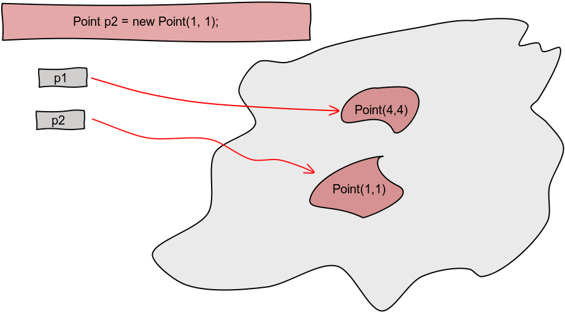

!SLIDE

##In Java everything is an Object*

!SLIDE 

# Primitive types
* Numerical: 2.71, 299792458, 6.626e-34
* Chars: 'e', 'C', 'h', '2', '%'
* Logical: true, false

!SLIDE 

# Numerical values
* Integers (..., -1, 0, 1, ...)
* Real Numbers (..., -1.0, 0.0, 1.0, ...) 

Type differs in number of bits allocated in memory 

Size and precision

!SLIDE bullets incremental

# Integers 

* byte - 8 bits
* short - 16 bits
* int - 32 bits
* long - 64 bits

!SLIDE bullets incremental

# Floating point numbers 

* float - 32 bits
* double - 64 bits

.notes double higher presicion (more decimals), wider range of values 

!SLIDE bullets incremental

# Characters

* char - 16 bits

!SLIDE bullets incremental 

# Aritmetic operators - Numerical ops.
* addition (+)
* subtraction (-)
* multiplication (*)
* division (/)
* remainder (%)

!SLIDE bullets incremental 

# Aritmetic operators - Op. precedence
* Higher priority: \* / %
* Lower priority: \+ -

!SLIDE smaller bullets incremental 

# Aritmetic operators - Comparision ops.
* == equals
* != Inequality
* \< less than
* \> grater than
* <= less than or equal to
* \>= greater than or equal to

!SLIDE center

!SLIDE

	@@@JAVA

	public class Point {

	}

!SLIDE

	@@@JAVA

	// FIELDS

	public class Point {

		private int x;
		private int y

	}

!SLIDE

	@@@JAVA

	// FIELDS
	// METHODS

	public class Point {

		private int x;
		private int y

		public int getX() { ... }
		public void setX(int x) { ... }

	}

!SLIDE

	@@@JAVA

	// FIELDS
	// METHODS
	// CONSTRUCTORS

	public class Point {

		private int x;
		private int y

		public int getX() { ... }
		public void setX(int x) { ... }

		public Point(int x, int y) { ... }

	}

!SLIDE

	@@@JAVA

	Point p1 = new Point(4, 4);

!SLIDE center

 

!SLIDE

	@@@JAVA

	Point p1 = new Point(4, 4);
	Point p2 = new Point(1, 1);

!SLIDE center

 

!SLIDE

	@@@JAVA

	Point p1 = new Point(4, 4);
	Point p2 = new Point(1, 1);
	Point p3 = null;

!SLIDE center

 

!SLIDE

	@@@JAVA

	Point p1 = new Point(4, 4);
	Point p2 = new Point(1, 1);
	Point p3 = null;
	p3 = p2;

!SLIDE center

 

!SLIDE

	@@@JAVA

	Point p1 = new Point(4, 4);
	Point p2 = new Point(1, 1);
	Point p3 = null;
	p3 = p2;
	p2 = new Point(6,6);

!SLIDE center

 

!SLIDE

	@@@JAVA

	public class Point {
		//...
	}

	public class Triangle {
		private Point p1;
		private Point p2;
		private Point p3;

		//...
	}

!SLIDE

	@@@JAVA

	Point p1 = new Point(4, 4);
	Point p2 = new Point(1, 1);
	Point p3 = null;
	p3 = p2;
	p2 = new Point(6,6);

	Triangle triangle = 
			new Triangle(p1, p2, p3);

!SLIDE center

 

